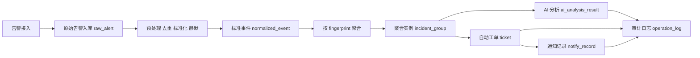

# 智能告警聚合与处理平台（AIAlert）

一个面向运维告警场景的智能告警中枢系统。

项目围绕“接入 → 标准化 → 去重/静默 → 聚合 → AI 分析 → 工单 → 通知 → 审计”构建端到端处理链路，目标是将分散、重复、噪声较多的原始告警，转化为可查询、可联调、可复盘、可扩展的结构化事件与处置结果。

当前版本定位为 **MVP / 演示型后端系统**：已经完成核心链路闭环，并支持本地快速启动、Swagger 联调、SQLite 持久化、内存队列演示、Redis Stream 可选解耦，以及 AI 分析结果落库与可回放验证。

---

## 项目背景

在真实运维场景中，告警系统通常面临几个典型问题：

- 告警来源多，格式不统一，接入成本高
- 同类告警短时间内大量重复，形成告警风暴
- 单条原始告警噪声高，难以直接驱动处置
- 处理过程缺乏结构化留痕，后续难以复盘与审计
- AI 常常停留在“文本分析”层面，没有真正嵌入业务闭环

本项目尝试解决的，不是单纯做一个告警展示页面，而是构建一个**具备可运行处理逻辑的告警中台原型**：把原始告警接进来，完成统一处理，形成聚合事件，并在此基础上驱动 AI 判定、工单创建、通知发送与审计留痕。

---

## 项目目标

本项目的核心目标如下：

- 提供统一的多源告警接入入口
- 对原始告警进行去重、标准化与规则预处理
- 基于 `fingerprint` 对重复/同类告警进行聚合，形成 `incident/group`
- 以 `incident/group` 为单位接入 AI，而不是直接对单条 `raw alert` 做分析
- 将 AI 结果结构化输出并落库，支持 `success / fallback / suppress` 等分支
- 自动驱动工单与通知流程，并对关键动作进行审计留痕
- 保证本地可快速运行、可联调、可演示、可复盘

---

## 当前版本能力边界

当前版本是 **MVP**，重点在于验证主链路是否闭环，而不是直接对标生产级告警平台。

### 已实现

- 多源接入统一入口：`POST /ingest/{source}`
- 原始告警持久化：`raw_alert`
- 接入幂等 / 重复告警不重复入库
- 规则预处理：支持 `dropped / silenced` 标记与原因记录
- 基于 `fingerprint` 的事件聚合
- 聚合结果实体：`incident_group`
- AI 分析：对 `incident/group` 构造结构化输入并输出结构化结果
- AI 结果落库：`ai_analysis_result`
- 工单自动创建：`ticket`
- 通知结果留痕：`notify_record`
- 审计流水留痕：`operation_log`
- SQLite 本地持久化
- In-Memory 模式本地演示
- Redis Stream 模式可选启用
- Swagger 分组与联调示例优化
- 演示脚本与关键链路接口校验

### 暂未实现或仍在规划

- 更复杂的聚合窗口与乱序处理
- 相似工单去重 / 合单策略
- 更完整的工单状态机
- 真实 IM / 邮件 / 飞书 / 企业微信通知集成
- 历史案例检索增强（RAG）
- Prometheus / Metrics 监控
- Kafka 等更贴近生产的消息解耦
- 更细粒度的规则引擎与策略配置中心
- 多租户 / 权限 / 配置管理能力

---

## 系统处理链路

AIAlert 的核心处理流程如下：



这个链路对应的设计思想是：

1. **接入层**只负责接收并保存原始告警，不在入口堆过多业务逻辑  
2. **预处理层**负责去重、规则过滤、静默判定、标准字段抽取  
3. **聚合层**负责把多条原始告警收敛成一个更适合处置的事件对象  
4. **AI 层**不是直接分析单条告警，而是对聚合后的 `incident/group` 做结构化判断  
5. **执行层**根据聚合结果与 AI 结果决定是否开单、是否通知  
6. **审计层**对关键动作全程留痕，便于查询、复盘与演示  

---

## 核心设计说明

### 1. 统一接入

项目提供统一入口：

- `POST /ingest/{source}`

不同来源的告警通过同一个入口进入系统，系统内部再进行标准化处理。这样可以把“外部接入差异”与“内部处理链路”分离，降低扩展新的告警源时的改动范围。

### 2. 原始告警不丢失

所有接入的原始告警优先落库到 `raw_alert`。即使后续被判定为 `dropped / silenced`，也保留基础记录与处理结果，避免“入口即丢弃”导致后续无法审计或复盘。

### 3. 标准化与规则预处理

原始告警进入系统后，会转换为统一事件视图并记录到 `normalized_event`。当前支持的处理结果包括：

- 正常进入后续链路
- 被规则过滤（`dropped`）
- 被静默规则抑制（`silenced`）

同时会记录对应原因，便于后续查询和演示。

### 4. 基于 fingerprint 的聚合

系统使用 `fingerprint` 作为聚合关键键，将重复或同类告警聚合为一个 `incident_group`。聚合实例维护的核心字段包括：

- `event_count`
- `first_seen_at`
- `last_seen_at`

这个设计的目的，是把“告警条数”与“待处置事件”分离。运维关注的通常不是第 37 条重复告警本身，而是“某个问题是否仍在持续、严重程度如何、是否值得处置”。

### 5. AI 接入方式

AIAlert 的 AI 能力不是对单条 `raw alert` 直接做自由文本判断，而是：

- 以 `incident_group` 为分析对象
- 对聚合结果构造结构化输入
- 输出结构化分析结果
- 将分析结果持久化，便于查询与复盘

当前结构化输出重点包括：

- `is_valid_alert`
- `severity`
- `confidence`
- `reason`
- `suggested_action`

并支持如下结果分支：

- `success`：正常返回结果
- `fallback`：低置信度或异常场景走兜底逻辑
- `suppress`：AI 判断为无效告警或不值得继续处置

### 6. 工单、通知与审计留痕

对满足条件的聚合事件，系统会自动创建 `ticket`。通知行为写入 `notify_record`。关键动作统一写入 `operation_log`，包括但不限于：

- 静默创建
- 工单创建
- 通知发送 / 抑制
- AI 抑制
- 关键状态流转

这样做的价值在于：即使这是一个 MVP，也不是“跑完就结束”的黑盒流程，而是一个可回看、可验证的闭环系统。

---

## 当前已验证的功能

基于当前版本的联调与测试，已经完成以下能力验证。

### 接口联调验证

已通过 Swagger / 接口调用验证如下主流程接口：

1. `GET /health`
2. `POST /ingest/{source}`
3. `GET /events`
4. `GET /groups`
5. `GET /ai_results`
6. `GET /tickets`
7. `GET /notify_records`
8. `GET /operation_logs`

### 规则与处理结果验证

已验证以下处理逻辑可正常落库或查询：

- 重复告警去重 / 幂等接入
- 标准化事件生成
- `dropped` 标记与原因记录
- `silenced` 标记与原因记录
- 聚合结果与 `event_count` 更新
- 工单生成与查询
- 通知发送 / 抑制结果留痕
- 关键操作审计流水写入

### AI 分支验证

已覆盖以下典型 AI 场景：

- **AI success**：正常返回结构化分析结果
- **low-confidence fallback**：低置信度时走 fallback
- **exception fallback**：调用异常 / 超时 / endpoint 异常时走 fallback
- **AI suppress**：模拟 AI 判定为无效告警并执行抑制逻辑

这部分验证的重点不是“大模型效果多强”，而是确认 AI 已被正确嵌入业务链路，且结果可落库、可查询、可复盘。

---

## 技术栈

当前版本主要采用以下技术栈：

- **Python**
- **FastAPI**：提供 HTTP API 与 Swagger 文档
- **SQLite**：本地开发与演示持久化
- **Redis Stream（可选）**：用于异步解耦模式演示
- **In-Memory Bus**：用于单机快速联调与演示
- **OpenAI Compatible API / Mock LLM**：用于 AI 分析能力接入与测试

技术选型原则比较明确：

- 本地快速启动优先
- 演示与联调优先
- 链路闭环优先
- 再逐步向生产化演进

---

## 数据模型说明

当前核心表包括：

- `raw_alert`：原始接入告警与接入基础信息
- `normalized_event`：标准化事件与 `dropped/silenced` 处理结果
- `incident_group`：聚合事件实例
- `ticket`：自动工单
- `notify_record`：通知留痕
- `operation_log`：关键操作审计流水
- `silence_rule`：静默规则
- `ai_analysis_result`：AI 结构化分析结果

这些表对应的关系可以概括为：

- `raw_alert` 记录入口事实
- `normalized_event` 记录规则处理结果
- `incident_group` 记录处置对象
- `ai_analysis_result`、`ticket`、`notify_record`、`operation_log` 记录处置动作与结果

---

## 快速开始

### 方式一：本地演示模式（推荐，不依赖 Redis）

在项目根目录执行：

```powershell
python -m pip install -r requirements.txt
$env:AIALERT_RUN_WORKER_IN_PROCESS="1"
$env:AIALERT_BUS="memory"
python -m uvicorn app.main:app --host 0.0.0.0 --port 8001
```

启动后访问：

- Swagger 文档：`http://localhost:8001/docs`


---

## Redis Stream 模式（可选）

如果希望更贴近异步解耦场景，可以切换到 Redis Stream 模式：

```powershell
$env:AIALERT_BUS="redis"
$env:REDIS_URL="redis://localhost:6379/0"
```

然后启动独立 Worker：

```powershell
python -m app.worker
```

这部分适合演示“接入进程”和“消费处理进程”解耦，但当前项目主目标仍是验证业务链路，而非完整消息中间件能力。

---

## 推荐联调 / 演示顺序

建议按以下顺序进行联调，比较容易把整条链路讲清楚：

1. `GET /health`  
   验证服务是否启动正常

2. `POST /ingest/{source}`  
   发送示例告警，观察原始接入是否成功

3. `GET /events`  
   查看标准化结果，确认 `dropped / silenced` 等状态

4. `GET /groups`  
   查看是否完成聚合，以及 `event_count` 是否符合预期

5. `GET /ai_results`  
   查看 AI 输出是否已结构化落库

6. `GET /tickets`  
   查看是否生成工单

7. `GET /notify_records`  
   查看通知是否发送或被抑制

8. `GET /operation_logs`  
   查看关键动作是否有完整审计留痕

这样一套演示下来，项目的“从接入到处置”的闭环会比较清晰。

---

## AI 测试场景

当前版本支持以下典型 AI 场景测试。

### 1. 正常 success

测试脚本：AIsuccess.ps1

默认使用 `mock` 模式，即可验证 AI 正常输出结构化结果。

### 2. 低置信度 fallback

测试脚本：lowconf.ps1

提高低置信度阈值，例如：

```powershell
$env:AIALERT_LLM_LOW_CONFIDENCE="0.95"
```

用于验证系统在 AI 结果不可靠时，是否能走兜底逻辑，而不是直接信任模型输出。

### 3. 异常 fallback

测试脚本：AIabnormal.ps1

切换为 OpenAI 兼容模式，并人为制造 `endpoint` 不可达 / 超时 / 响应异常，验证异常场景下系统是否仍能继续执行兜底流程。

### 4. AI suppress

测试脚本：AIsuppress.ps1

在 mock 模式下强制模型返回无效告警判断，验证系统是否能产生 AI 抑制结果，并保留对应记录。

```powershell
$env:AIALERT_LLM_MODE="mock"
$env:AIALERT_LLM_MOCK_FORCE_INVALID="1"
```

---

## 环境变量

### 基础配置

- `AIALERT_DB_PATH`  
  SQLite 数据库路径，默认 `data/aialert.db`

- `AIALERT_RUN_WORKER_IN_PROCESS`  
  是否在 API 进程内启动 Worker，`1/0`

- `AIALERT_BUS`  
  消息总线模式：`memory` / `redis`

- `REDIS_URL`  
  Redis 连接串，例如 `redis://localhost:6379/0`

- `AIALERT_AGG_WINDOW_SECONDS`  
  聚合窗口秒数，默认 `300`

### AI 相关配置

- `AIALERT_LLM_MODE`  
  `mock` / `openai` / `disabled`

- `AIALERT_LLM_LOW_CONFIDENCE`  
  低置信度阈值，默认 `0.6`

- `AIALERT_LLM_TIMEOUT_SECONDS`  
  调用超时，默认 `3`

- `AIALERT_LLM_ENDPOINT`  
  OpenAI 兼容 Chat Completions endpoint

- `AIALERT_LLM_API_KEY`  
  API Key

- `AIALERT_LLM_MODEL`  
  模型名，用于调用或记录标识

- `AIALERT_LLM_MOCK_FORCE_INVALID`  
  mock 模式下强制 `is_valid_alert=false`，`1/0`

- `AIALERT_LLM_MOCK_INVALID_CONFIDENCE`  
  mock 模式下无效告警 `confidence`，默认 `0.95`

---

## Swagger 文档优化点

为了降低联调成本，当前版本对 Swagger 做了针对性改造：

- 按业务流程分组展示接口
- 为关键写接口提供示例请求体
- 为查询接口补充建议关注字段与过滤参数
- 便于按照“接入 → 聚合 → AI → 工单 → 通知 → 审计”的顺序演示

项目的目标不是只提供“可调用接口”，而是尽量让演示者和阅读者快速理解系统行为。

---

## 当前局限性

虽然主链路已经打通，但当前版本仍存在明显局限：

- 规则能力仍偏轻量，尚未形成完善规则引擎
- 聚合策略较基础，尚未覆盖更复杂生产场景
- 工单与通知能力主要用于流程验证，未接入真实外部平台
- AI 评估仍以链路验证为主，缺少系统性效果评测
- 缺少监控、告警、自恢复等平台级能力
- 仍偏单机演示架构，距离生产化还有较大演进空间

这些局限并不影响它作为一个完整的后端项目原型，但需要明确写清楚，避免给人“过度包装”的印象。

---

## 后续规划

下一阶段重点会放在以下几个方向：

### 规则与聚合能力增强

- 更完整的聚合窗口管理
- 乱序事件处理
- 相似告警聚合策略
- 相似工单去重 / 合单

### AI 能力增强

- 引入历史案例检索增强（RAG）
- 更细化的结构化输出协议
- AI 结果评估与回放能力
- Prompt 模板与可配置策略分离

### 执行链路增强

- 接入真实通知渠道（飞书 / 钉钉 / 企业微信 / 邮件）
- 完善工单状态机与人工反馈闭环
- 引入更细粒度的审核与升级策略

### 平台化能力增强

- Prometheus / Metrics 指标监控
- Kafka 等消息系统接入
- 配置中心 / 规则中心
- 多租户与权限控制
- 更标准的部署与运维方式

---

## 项目定位总结

AIAlert 当前不是一个“功能堆满的生产平台”，而是一个已经跑通核心业务链路的智能告警处理系统原型。

它的价值主要体现在三个方面：

1. 把告警从“原始事件流”转换为“可处置对象”
2. 把 AI 从“外挂分析”嵌入到实际处理流程中
3. 让关键动作可落库、可查询、可审计、可复盘

对于后续继续扩展规则、消息解耦、通知集成、工单闭环与 AI 增强，这个版本已经具备较好的基础。